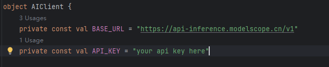
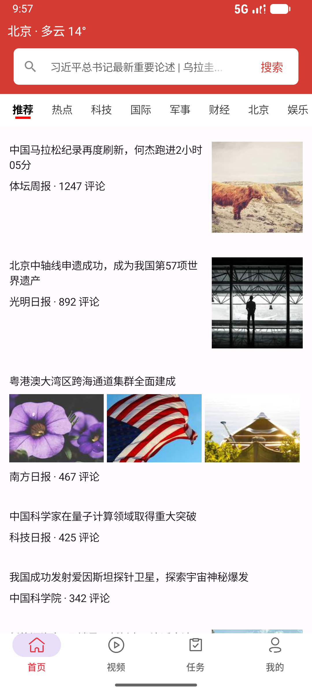
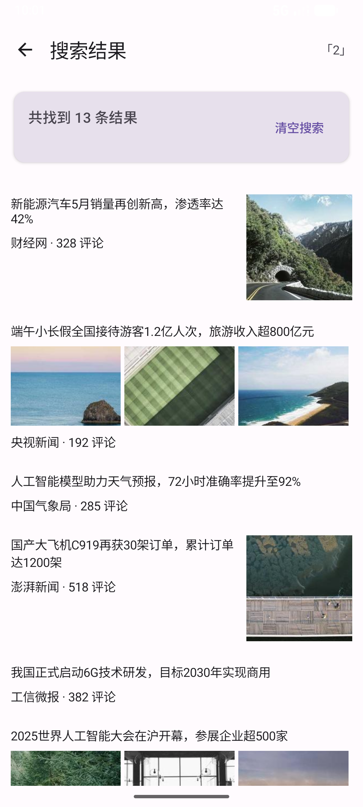
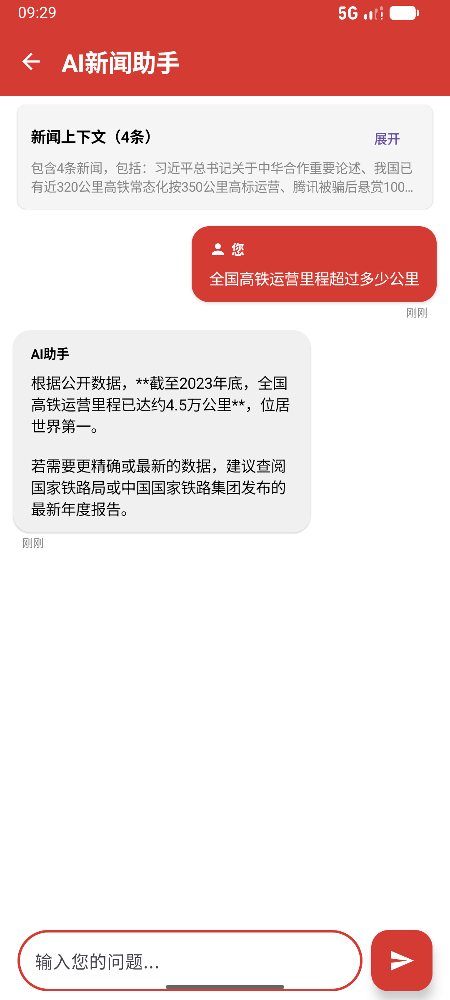
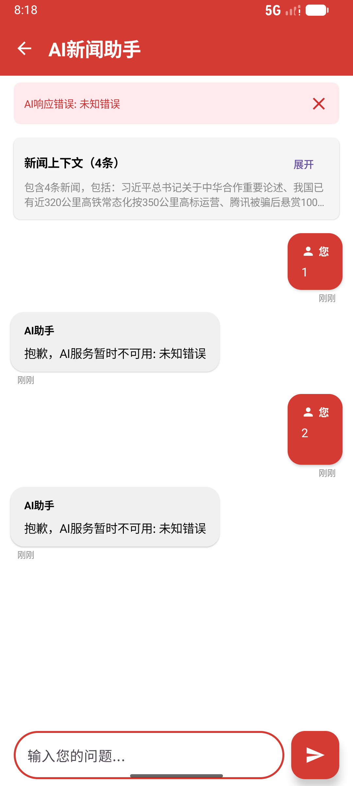
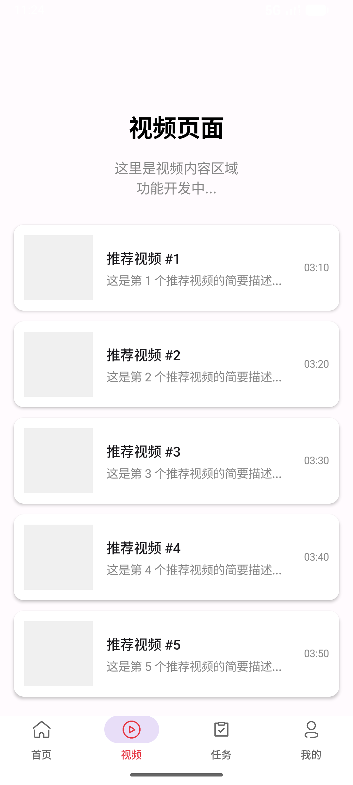
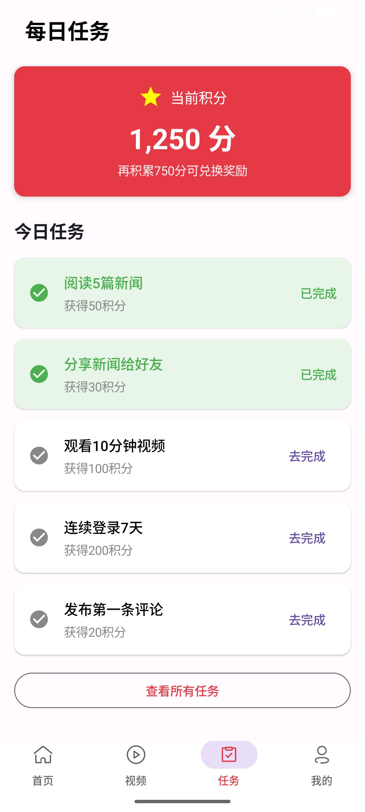
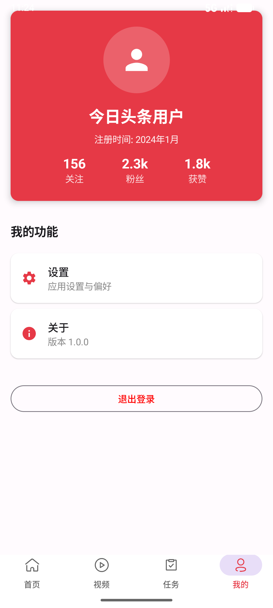

# Toutiao News Client (Jetpack Compose)

本项目是一个基于 **Jetpack Compose** 构建的现代化新闻客户端应用。它采用 **MVVM** 架构设计，实现了完整的新闻浏览、搜索、详情查看功能，并集成了基于 **DeepSeek-V3.2** 的流式 AI 问答助手。

 项目技术文档：https://ai.feishu.cn/wiki/RVT5wFDuZiHkeJkSAwLcbSr2nuh?from=from_copylink

## 📱 项目演示

本项目实现了从数据持久化、分页加载到声明式 UI 渲染的完整链路。

项目运行前，请先申请一个modelscope api，并填入apikey



### 📸 截图
<table>
  <thead>
    <tr>
      <th width="15%">页面名称<br>(Screen)</th>
      <th width="30%">界面预览<br>(Preview)</th>
      <th width="55%">功能与技术详解<br>(Technical Details)</th>
    </tr>
  </thead>
  <tbody>
    <tr>
      <td align="center"><b>首页<br>Home Screen</b></td>
      <td align="center">
        
        
      </td>
      <td>
        <b>1. 上滑分页加载 (Infinite Scroll)</b><br>
        利用 <code>Paging 3</code> 结合 Room 数据库的 OFFSET/LIMIT 查询实现。监听列表滚动位置，当距离底部 5 个 item 时自动触发下一页加载 。<br><br>
        <b>2. 下拉刷新 (Pull-to-Refresh)</b><br>
        使用 <code>SwipeRefresh</code> 组件包裹列表。在 ViewModel 中管理 <code>RefreshState</code>，刷新完成后调用 <code>pagingItems.refresh()</code> 重置分页状态而不破坏现有展示 。<br><br>
        <b>3. 频道切换 (Channel Tabs)</b><br>
        自定义 <code>ChannelTabRow</code> 实现横向拖拽。每个频道对应独立的 PagingSource，切换时利用 weight 字段进行热门排序并重新创建数据流。
      </td>
    </tr>
    <tr>
      <td align="center"><b>搜索页<br>Search Screen</b></td>
      <td align="center"></td>
      <td>
        <b>1. 模糊搜索优化 (Fuzzy Search)</b><br>
        基于 Room 的模糊正则匹配。在 <code>NewsDao</code> 中建立 title 和 source 索引。利用 <code>MutableStateFlow</code> 实时响应搜索词变化。<br><br>
        <b>2. 结果展示 (Dynamic Rendering)</b><br>
        复用首页新闻卡片组件，使用 <code>when</code> 表达式根据 <code>NewsItem</code> 类型（纯文、单图等）渲染对应 UI。结果按相关性排序，并显示匹配数量统计。
      </td>
    </tr>
    <tr>
      <td align="center"><b>新闻详情页<br>Detail Screen</b></td>
      <td align="center"></td>
      <td>
        <b>1. 富文本渲染 (Rich Text)</b><br>
        自定义 <code>RichTextComposer</code> 组件，使用 <code>AnnotatedString</code> 处理段落间距和首行缩进。针对图片使用 Coil 的 <code>AsyncImage</code> 并动态计算高度适配屏幕 。<br><br>
        <b>2. 多类型适配 (Adaptive UI)</b><br>
        针对不同新闻类型设计专用 Composable：<code>RightImageCover</code> (单图)、<code>ThreeImageCover</code> (三图)、<code>VideoCover</code> (视频) 等。<br><br>
        <b>3. 状态管理 (State Handling)</b><br>
        通过 <code>LaunchedEffect</code> 监听 ID 变化，统一管理 <code>isLoading</code> (加载动画)、<code>errorMessage</code> (错误页) 和 <code>news</code> (内容) 三种 UI 状态。
      </td>
    </tr>
    <tr>
      <td align="center"><b>AI 助手页<br>AI Chat Screen</b></td>
      <td align="center">
        
        
        
      </td>
      <td>
        <b>1. 流式推理 (Streaming Inference)</b><br>
        基于 DeepSeek-V3.2 模型，使用 OpenAI 兼容接口。前端通过自定义 <code>OkHttp + EventSource</code> 实现了 Android 端对 SSE (Server-Sent Events) 的流式解析，支持断流重连。<br><br>
        <b>2. 思维链展示 (Chain of Thought)</b><br>
        解析 SSE 数据包中的 <code>reasoning_content</code> 和 <code>content</code>，在 UI 上分段渲染 AI 的“思考过程”（灰色斜体）和“最终回答”。<br><br>
        <b>3. 上下文注入 (Context Injection)</b><br>
        自动提取当前阅读新闻的标题、来源和摘要，构建 System Prompt，使 AI 能基于具体新闻事实回答用户提问。
      </td>
    </tr>
    <tr>
      <td align="center"><b>其他功能页<br>Other Screens</b></td>
      <td align="center">
        
        
        
      </td>
      <td>
        <b>1. 视频与任务 (Video & Task)</b><br>
        包含视频流页面（开发中）与每日任务页面（积分系统）。任务页展示每日阅读、分享等任务进度。<br><br>
        <b>2. 个人中心 (Profile)</b><br>
        展示用户关注数、粉丝数及获赞数，提供应用设置入口。
      </td>
    </tr>
  </tbody>
</table>

**主要特性：**
* **现代化 UI**：全线使用 Jetpack Compose 构建声明式界面。
* **AI 深度集成**：内置基于 DeepSeek 的 AI 助手，支持流式输出 (SSE) 和思维链 (Chain of Thought) 展示。
* **高性能列表**：基于 Paging 3 的无限滚动与多级缓存策略。
* **富文本渲染**：自定义组件解析 Markdown 及复杂新闻排版。

## 🛠 技术栈

### 核心架构
* **语言**: Kotlin
* **UI 框架**: Jetpack Compose (Material Design 3)
* **架构模式**: MVVM (Model-View-ViewModel) + Repository Pattern
* **异步处理**: Kotlin Coroutines & Flow
* **导航**: Navigation Compose

### 数据与网络
* **本地数据库**: Room Database (支持模糊搜索与正则匹配)
* **分页加载**: Jetpack Paging 3
* **网络请求**: OkHttp (自定义 SSE 解析)
* **图片加载**: Coil (AsyncImage)
* **AI 模型**: ModelScope Inference API (DeepSeek-V3.2)

## ✨ 核心功能详解

### 1. 新闻流与分页 (News Feed)
* **智能分页**: 使用 `Paging 3` 结合 Room 数据库实现 `OFFSET/LIMIT` 查询。监听列表滚动，距离底部 5 个 item 时自动触发加载。
* **下拉刷新**: 集成 `SwipeRefresh`，在 ViewModel 中管理刷新状态，重置分页数据。
* **频道管理**: 自定义 `ChannelTabRow`，支持横向拖拽切换频道。每个频道拥有独立的 PagingSource。

### 2. 智能搜索 (Smart Search)
* **混合搜索**: 使用 Room 的模糊正则匹配功能。
* **实时响应**: 利用 `MutableStateFlow` 监听搜索词变化，实时更新结果。
* **UI 细节**: 实现了类似原生应用的搜索框 Placeholder 渐隐 (Fading) 效果。

### 3. AI 新闻助手 (AI Chat)
* **流式响应**: 通过 SSE (Server-Sent Events) 处理 OpenAI 兼容接口的流式输出。
* **思维链展示**: 解析 DeepSeek 特有的 `reasoning_content`，将 AI 的“思考过程”与“最终回答”分段渲染 。
* **上下文注入**: 自动提取当前新闻内容的摘要注入 Prompt，实现基于新闻事实的问答。

### 4. 多级缓存策略 (Caching)
应用实现了三级数据获取策略，确保离线可用性与加载速度：
1.  **L1 内存缓存**: `NewsLocalDataSource` (优先读取)
2.  **L2 数据库缓存**: `Room` (持久化存储)
3.  **L3 网络/Mock**: `MockNews` (兜底数据源)

## 📂 项目目录结构

```text
com.example.toutiao
├── api                  // 网络与AI服务层
│   ├── AIClient.kt      // AI 客户端配置
│   ├── AIService.kt     // 推理接口定义
│   └── SSEvent.kt       // SSE 流式事件数据类
├── data                 // 数据层 (Repository & Room)
│   ├── AppDatabase.kt   // Room 数据库实例
│   ├── NewsDao.kt       // 数据库访问接口
│   ├── NewsEntity.kt    // 数据库实体
│   ├── NewsRepository.kt// 数据仓库 (统一数据源)
│   └── ...
├── model                // 业务模型
│   ├── AIModels.kt      // AI 对话相关模型
│   ├── NewsItem.kt      // UI 层使用的密封类模型
│   └── ...
├── navigation           // 路由配置
│   └── NavGraph.kt      // Compose 导航图
├── ui                   // 界面层
│   ├── ai               // AI 对话界面
│   ├── components       // 通用 UI 组件 (新闻卡片等)
│   ├── topBar           // 顶部栏与搜索框组件
│   ├── HomeScreen.kt    // 主页
│   ├── NewsDetailScreen.kt // 新闻详情页
│   └── ...
├── utils                // 工具类
│   └── MarkdownParser.kt // Markdown 解析工具
└── viewmodel            // 状态管理
    ├── AIChatViewModel.kt // AI 对话逻辑
    └── NewsViewModel.kt   // 新闻列表与搜索逻辑
    └──NewsViewModelFactory.kt

└── MainActivity.kt
```
## 🚀 关键实现代码片段
**AI 流式处理 (SSE)**

Android 原生不支持 SSE，项目通过 OkHttp 自定义了事件监听：
```kotlin
// 监听 thinking 和 content 字段的分离
delta?.reasoningContent?.takeIf { it.isNotBlank() }?.let {
    onEvent(SSEvent(type = "thinking", content = it))
}
delta?.content?.takeIf { it.isNotBlank() }?.let {
    onEvent(SSEvent(type = "content", content = it))
}
```
**Paging 3 自动加载**
```kotlin
// 监听滚动位置触发翻页
val isNearBottom = remember {
    derivedStateOf {
        val lastVisibleItem = layoutInfo.visibleItemsInfo.lastOrNull()
        // ... 判断逻辑
        lastVisibleItem.index >= totalItemsCount - 5
    }
}
```